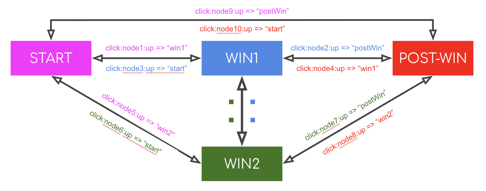

# fsm
A finite state machine using erx

https://github.com/FutureAdLabs/erx

https://www.npmjs.com/package/@adludio/erx

## Overview and structure

### Overview

The objective of a finite state machine (FSM) is to introduce the concept that something can be in only one "current state" at a given time. Specifically, our FSM is responsible for maintaining the current state of an adunit and triggering navigation to other states. It provides a programmatic way of describing a user journey in code when running of an adunit; what happens and when it happens.

An adunit starts in an initial "state", and has to be "triggered" by an event, be it a user-interaction (tapping on the screen etc) or triggered programmatically by a specific piece of code. Generally, the majority of adunits created by Adludio follow a set of user interactions in a linear user journey. An example of a typical user journey is shown below:


The adunit begins in the "start" state and runs whatever code is specified to run in the "start" state. It will stay in the "start" state until an event is fired that matches the conditions specified in the "triggers" for the "start" state.

So for example, the trigger for the "start" state could be
`"click:node1:up" => "win"`
This means that while the user is in the "start" state, if *node1*" (a layer in the adunit) receives the *clickUp* event, then navigate to the *win* state. When entering the "win" state, the code associated with the win state will run. 

Similarly if the trigger for the "win" state is 
`"click:node2:up" => "postWin"`
a *clickUp* event for *node2* will result in navigating to the *postWin* state.

**States**
- start
- win
- postWin

**Triggers**

Start
- `"click:node1:up" => "win"`

Win
- `"click:node2:up" => "postWin"`

However, not all adunits will have a linear user journey, and navigation between states can be determined by a multiple of triggers.



In this example, there are a number of different triggers associated with each state, allowing navigation to and from any state as defined by separate triggers. This diagram is showing all the different combinations by which you can navigate between states, for example while in the "start" state you can go to the "win1" state, and while in the "win1" state, you can go back to the "start" state again.

**States**
- start
- win1
- win2
- postWin

**Triggers**

Start
- `"click:node1:up" => "win1"`
- `"click:node5:up" => "win2"`
- `"click:node9:up" => "postWin"`

Win1
- `"click:node2:up" => "postWin"`
- `"click:node3:up" => "start"`
- `..`

Win2
- `"click:node6:up" => "start"`
- `"click:node7:up" => "postWin"`
- `..`

PostWin
- `"click:node4:up" => "win1"`
- `"click:node8:up" => "win2"`
- `"click:node10:up" => "start"`

### Code Structure (only devs allowed)

When initialising the machine, the FSM takes two parameters:

- *Triggers*
- *States*

As a recap:

The *Triggers* object is a set of conditions that determine whether or not the machine will navigate to the next state. (when/how)

The *States* object is what happens while in each respective state. (what)

As a wise man once said; 

”Watch this” (triggers)
”Do that” (states)

In the game.js the developer will have to define the triggers and states object
Triggers example:

```
{
  "start": {
    "paint:start:reveal-layer": () => "revealing"
  },
  "win": {...},
  ...
}
```

When in the start state, if a "paint:start:reveal-layer" event is "sent" to the machine, then machine.goTo("revealing") state (and then run that "revealing" state function)

States example:

```
{
  "start": {
    animations: (m, state) => {
      let rep = m.whileIn(anim.start(state), "start");
      return update.stream(state.events, rep);
    },
    onEnter: () => {},
    onExit: () => {}
  },
  "win": {...},
  ...
}
```

When in "start" state, the "onEnter" and then the "animations" functions are run. When leaving "start" state, the "onExit" function is run.
States are broken down into three parts:

- *animations*
- *onEnter*
- *onExit*

The *animations* function is used for determining which animations will play in that state. The update.stream function is a promise, allowing you to chain animations in sequence if you please. An onAnimationEvent is pushed to cyan's eventBus automatically after every animation has concluded, which can be caught with an appropriate trigger.

The *onEnter* function is used to "set-up" the scene for the next state and ensure that code can be run before the animations even occur. Examples of how this could be useful include, adding a node that you want to animate in the state, or adding a component to a node (in reality, adding a nodeId to the systems object) so that the user can interact with that node and trigger a state change.

The *onExit* function is used for clearing up unwanted ... stuff; nodes, components, clearing Timeouts etc. It is fired whenever you exit the current state.

## API

The FSM exposes two methods that allow you to navigate between states:
- goTo
- send

### goTo(next: StateName, getState?: (() => S)): boolean
- "next" must be a string specifying the name of the state you want to navigate to
- "getState" is an optional function that you can pass that will return the state when called
- returns a boolean, which indicates whether it has succeeded in navigating to the specified state

The goTo function first checks whether the fsm is already transitioning from one state to another, and if so returns false.

It then checks whether or not the "next" (state) that you passed to it exists in the states object, and if not throws an error.

If both checks pass, it will then move onto running the functions associated with your current state and the next state (the one you specified as the first argument). These functions will run in the sequence:

  currentState              nextState            nextState
onExit(optional)   ->   onEnter(optional)   ->   animations

And finally, it will set the internal "currentState" of the machine to the state you provided to the goTo function.

Recap/example:
- In "start" state
- m.goTo("win", () => "lol")
- "win" is in the states object, and isn't transitioning, passes checks
- runs states.start.onExit function (if exists)
- then sets internal currentState of the machine to be "win" and pushes the new currentState to the machine bus
- then runs states.win.onEnter function (if exists)
- then runs states.win.animations
- returns true

**Note: When building an adunit as a dev, it is recommended that you use the wrapper functions update.state or update.goTo located in cyan instead of directly accessing the methods attached to the machine, as it will pass through the events.fold in cyan's core, which has access to our scene and thus a getState function with an updated state.**

### send(event: EventID, getState?: (() => S)): boolean
- "event" must be a string specifying the trigger you want to check for, which in itself contains the name of the state to navigate to. OR it can also be the state you want to navigate to, similar to the goTo function
- "getState" is an optional function that you can pass that will return the state when called
- returns a boolean, which indicates whether it has succeeded in navigating to the specified state

The send function wraps the goTo function after making some checks.

The goTo function first checks whether the fsm is already transitioning from one state to another, or whether its not currently in a state, and if either are true it will return false.

The second check is for whether the event provided is included in the triggers for the currentState and if so set the nextState to be whatever that trigger declares to be the nextState.

The third is for if you have implicitly passed the nextState string to the send function instead of an event, and after a check that that state does indeed exist, sets it as the nextState.

The goTo function is then called with this nextState string and the optional getState function:

Recap/example:
- In "start" state
- m.send("click:node1:up", () => "lol")
- Not transitioning and is already in a state, passes check
- Check shows that event is property of triggers object, and value is a trigger function
- Trigger function is called, giving the nextState ("win")
- Calls goTo function with the nextState and returns the result

**Note: When building an adunit as a dev, it is recommended that you use the wrapper functions update.state or update.goTo located in cyan instead of directly accessing the methods attached to the machine (m.goTo and m.send), as it will pass through the events.fold in cyan's core, which has access to our scene and thus a getState function with an updated state.**

### whileIn<A>(stream: erx.Stream<A>, state: StateName): erx.Stream<A>
- "stream" is any stream you want to impose a restriction against in relation to the machine stream's current value/currentState
- "state" is the string you must to compare against the machine stream, and perform an action based on the result
- In this case we will only sample the stream that is passed while the currentState is equal to the state that we pass

Recap/example:
- In start state
- const bla = m.whileIn("a stream of data", "start")
- do something with bla (like pipe to events stream for example)
- We move to "win" state, and bla stream will close

In the dev build world, this is very useful for playing animations only while in a particular state, white-listing the state it can be played in.

### until<A>(stream: erx.Stream<A>, states: Array<StateName>): erx.Stream<A>
- "stream" is any stream you want to impose a restriction against in relation to the machine stream's current value/currentState
- "states" is an array of strings you must to compare against the machine stream, and perform an action based on the result
- In this case we will only sample the stream that is passed while the currentState is not equal to any of the state string that we pass in the states array

Recap/example:
- In start state
- const bla = m.until("a stream of data", ["win1", "win2"])
- do something with bla (like pipe to events stream for example)
- We move to "win1" state, and bla stream will close

In the dev build world, this is very useful for playing animations only while not in a one of a list of states, black-listing this...list.

## Old FSM 1.01 -> New ?

A small but significant refactor of FSM was required in order to increase the flexibility in order to deal with edge cases and ensure predictable behaviour, in preparation for the creation of a new Studio product harnessing a new programmatically generated json structure (cyan-json).
An instance of FSM was previously constructed with 3 props; new FSM(states, transitions, entries). 

First of all "states" was renamed to "triggers" and "entries" renamed to "states" to better describe their use, and the underlying logic tweaked to allow for passing of state events, or the state names themselves.

Secondly the "transitions" object was merged with entries and made specific to a single state in the form of hooks (onEnter, onExit), rather than being a function that is called when navigating between two states.

Third, code that would normally be run in the entry function could be split in terms of the concerns into animations (that must happen during the state) and everything else. This provides a standardized pattern so that states loosely correspond to the animations played inside them, but allows for flexibility for other things that affect the behaviour of an adunit, like setting up or modifying the scene.
